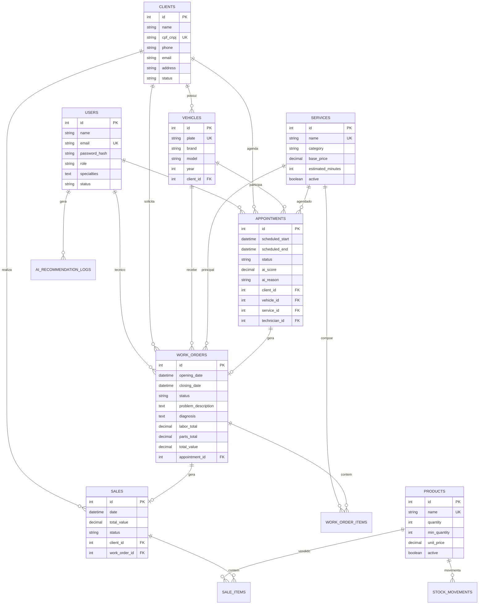

# DER do MVP

```mermaid
erDiagram
    USERS ||--o{ APPOINTMENTS : tecnico
    USERS ||--o{ WORK_ORDERS : tecnico
    USERS ||--o{ AI_RECOMMENDATION_LOGS : gera
    CLIENTS ||--o{ VEHICLES : possui
    CLIENTS ||--o{ APPOINTMENTS : agenda
    CLIENTS ||--o{ WORK_ORDERS : solicita
    CLIENTS ||--o{ SALES : realiza
    VEHICLES ||--o{ APPOINTMENTS : participa
    VEHICLES ||--o{ WORK_ORDERS : recebe
    SERVICES ||--o{ APPOINTMENTS : agendado
    SERVICES ||--o{ WORK_ORDERS : principal
    SERVICES ||--o{ WORK_ORDER_ITEMS : compoe
    APPOINTMENTS ||--o| WORK_ORDERS : gera
    WORK_ORDERS ||--o{ WORK_ORDER_ITEMS : contem
    WORK_ORDERS ||--o| SALES : gera
    PRODUCTS ||--o{ SALE_ITEMS : vendido
    PRODUCTS ||--o{ STOCK_MOVEMENTS : movimenta
    SALES ||--o{ SALE_ITEMS : contem

    USERS {
      int id PK
      string name
      string email UK
      string password_hash
      string role
      text specialties
      string status
    }

    CLIENTS {
      int id PK
      string name
      string cpf_cnpj UK
      string phone
      string email
      string address
      string status
    }

    VEHICLES {
      int id PK
      string plate UK
      string brand
      string model
      int year
      int client_id FK
    }

    SERVICES {
      int id PK
      string name UK
      string category
      decimal base_price
      int estimated_minutes
      boolean active
    }

    APPOINTMENTS {
      int id PK
      datetime scheduled_start
      datetime scheduled_end
      string status
      decimal ai_score
      string ai_reason
      int client_id FK
      int vehicle_id FK
      int service_id FK
      int technician_id FK
    }

    WORK_ORDERS {
      int id PK
      datetime opening_date
      datetime closing_date
      string status
      text problem_description
      text diagnosis
      decimal labor_total
      decimal parts_total
      decimal total_value
      int appointment_id FK
    }

    PRODUCTS {
      int id PK
      string name UK
      int quantity
      int min_quantity
      decimal unit_price
      boolean active
    }

    SALES {
      int id PK
      datetime date
      decimal total_value
      string status
      int client_id FK
      int work_order_id FK
    }
```
